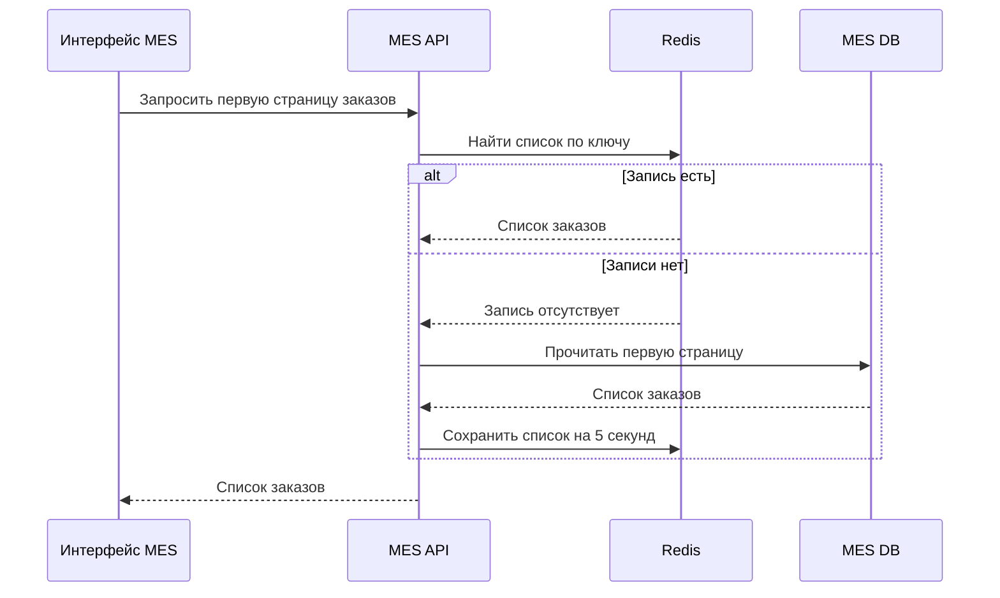
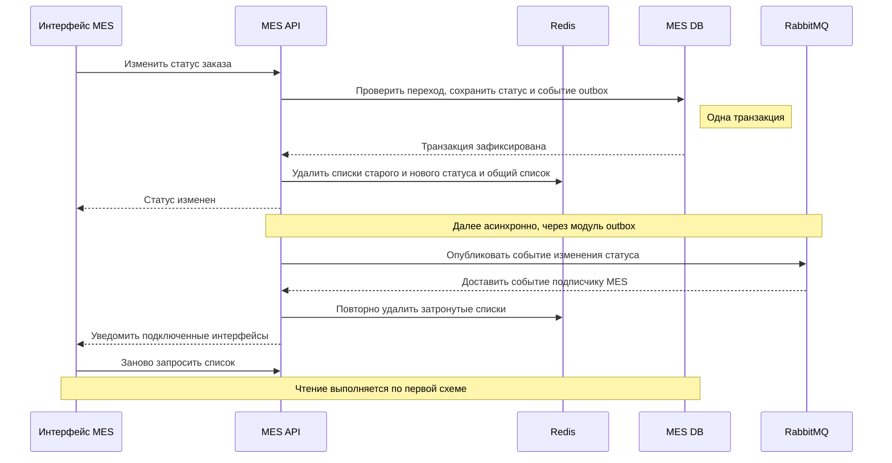

# Архитектурное решение по кешированию

## 1. Мотивация

Кешируем **первую страницу списка заказов MES**: операторам нужны самые новые заказы, а повторное чтение одинакового списка создает лишние обращения к MES DB.

Цель - сократить время открытия списка и нагрузку на БД, чтобы операторы быстрее находили и брали заказы в работу. Кеш ускоряет повторные чтения, но не устраняет причину медленного запроса при первом обращении.

Поэтому сохраняем ранее предложенные курсорную пагинацию по `(created_at, id)` и индексы под фильтр и сортировку.

## 2. Предлагаемое решение

### 2.1. Где и что кешируем

Используем **серверный кеш в Redis**, общий для экземпляров MES API. MES DB остается источником актуальных данных. Логику чтения и удаления кеша размещаем в MES API, отдельный сервис не добавляем.

Клиентский кеш списка не используем: копии в браузерах операторов обновлялись бы независимо. Общий серверный кеш позволяет повторно использовать результат между операторами; обновление открытых страниц выполняется через ранее предложенные уведомления о событиях.

| Параметр | Решение |
|---|---|
| Содержимое | Первая страница: идентификатор, статус, даты и остальные поля, необходимые списку; без 3D-файлов и персональных данных клиента. |
| Фильтры | Стандартные представления по одному статусу и без фильтра. Одинаковый размер страницы. |
| Сортировка | `created_at DESC, id DESC` - сначала новые заказы. |
| Срок жизни | **5 секунд с момента записи**, без продления при чтении. |
| Что не кешируем | Последующие страницы, произвольные сочетания фильтров, персонализированные списки и операции изменения заказа. |

### 2.2. Паттерн кеширования

Выбираем **Cache-Aside - заполнение кеша по запросу**: MES API проверяет Redis; при отсутствии записи читает MES DB и сохраняет результат в Redis.

| Паттерн | Оценка для MES |
|---|---|
| **Cache-Aside - выбран** | Заполняются только запрошенные списки. После изменения заказа достаточно удалить затронутые записи; не нужно пересчитывать все представления во время записи. Первый запрос после удаления обращается к БД. |
| **Write-Through - запись через кеш** | Запись в БД и обновление кеша входят в один путь записи. Для списка недостаточно обновить один заказ: меняются состав страницы и ее границы. Пересчет страниц усложнит и замедлит изменение статуса. |
| **Refresh-Ahead - заблаговременное обновление** | Может уменьшить задержки при истечении срока жизни часто читаемых записей. Но требует фонового обновления и все равно не заменяет реакцию на изменение статуса. На первом этапе не выбираем, пока измерения не подтверждают его необходимость. |

### 2.3. Чтение списка

1. MES API формирует ключ по статусу и размеру первой страницы.
2. Если запись есть в Redis - возвращает ее без обращения к MES DB.
3. Если записи нет - читает страницу из MES DB, сохраняет ее в Redis одной операцией со сроком жизни 5 секунд и возвращает оператору. Пустой список также можно сохранить; ошибки БД не кешируются.

Последующие страницы читаются из MES DB с курсором `(created_at, id)`.

### 2.4. Изменение статуса заказа

1. MES API проверяет допустимость перехода по данным **MES DB**. Статус и событие в таблице `outbox` сохраняются одной транзакцией.[^outbox]
2. После успешной фиксации транзакции API удаляет первые страницы старого статуса, нового статуса и списка без фильтра. Затем возвращает результат операции.
3. Существующий модуль `outbox` публикует событие в RabbitMQ. Подписчики MES повторяют удаление кеша и уведомляют подключенные интерфейсы; браузеры заново запрашивают список. При нескольких экземплярах MES уведомление должно доходить до каждого экземпляра с подключенными операторами.

Изменения от CRM и фоновых расчетов используют ту же логику **после сохранения результата в MES DB**. Создание заказа очищает страницу его статуса и общий список; изменение отображаемых полей - страницу текущего статуса и общий список.

При одновременной попытке взять заказ проверка свободного состояния и назначение оператора выполняются одним условным обновлением в БД. Успех получает только тот запрос, который действительно изменил строку; другому возвращается конфликт и предложение обновить список.[^db]

### 2.5. Инвалидация кеша

Выбираем **программное удаление конкретных ключей после записи в БД плюс короткий срок жизни**.

| Стратегия | Почему используем или отклоняем |
|---|---|
| **Удаление по ключам после изменения + 5 секунд** | Основной вариант: затронутые списки удаляются сразу после фиксации изменения. Срок жизни ограничивает хранение старой записи при пропущенном удалении. |
| Только срок жизни | Проще, но даже при штатной работе старые статусы остаются в кеше до истечения срока. Для списка доступных заказов этого недостаточно. |
| Только события | Позволяют реагировать на изменения, но задержка события или ошибка обработчика может оставить запись без ограничения по времени. |
| Очистка всего кеша | Сбрасывает незатронутые списки и создает лишние обращения к БД. Очистку всего Redis не выполняем: там могут быть и счетчики квот. |

### 2.6. Ограничения и отказы

Кеш не дает строгой согласованности: параллельное чтение может успеть сохранить старый список уже после удаления. На первом этапе принимаем кратковременную устарелость списка; срок жизни ограничивает время хранения такой записи. Назначение заказа всегда проверяется в БД, поэтому устаревший экран не позволяет выдать заказ двум операторам.

Истечение срока жизни в Redis **само не обновляет браузер**. Интерфейс перечитывает список по уведомлению, после переподключения и по действию оператора. Мгновенное одинаковое отображение на всех экранах не гарантируется.

При недоступности Redis API читает MES DB с ограниченным временем ожидания кеша.

### 2.7. Диаграммы последовательности

#### Чтение списка

#### Изменение статуса

Модуль outbox и обработчик событий показаны в составе MES API. На схеме - успешное изменение; ошибки описаны в разделе 2.6.

## 3. Внедрение и проверка результата

Сначала оптимизируем запрос списка и измеряем его время без кеша. Затем включаем кеширование за ранее предложенным флагом функции и проверяем: пустой кеш, смену статуса, новый заказ, повторы и задержки событий, одновременные чтения пустого кеша, назначение одного заказа двумя операторами и отказ Redis.

В Grafana отслеживаем **p95 ответа списка, долю чтений из кеша, число запросов списка к БД и ошибки Redis**. Через трейсинг и логи проверяем путь чтения и удаления кеша.

Кеш оставляем, если при одинаковой нагрузке время ответа и число чтений БД снижаются, а проверки назначения заказа проходят. При частых изменениях кеш может почти не использоваться - тогда отключаем его, а не добавляем новые механизмы.
